# Модель прецедентів

## Загальна схема

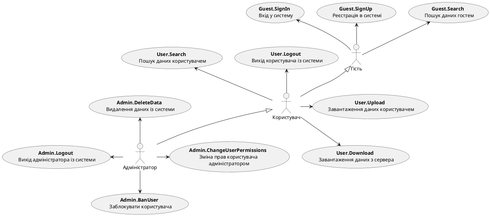

## Гість

 
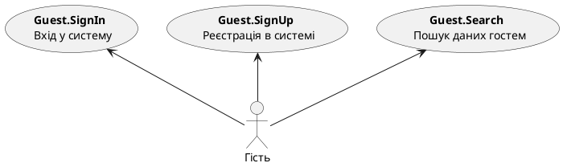

## Користувач

  
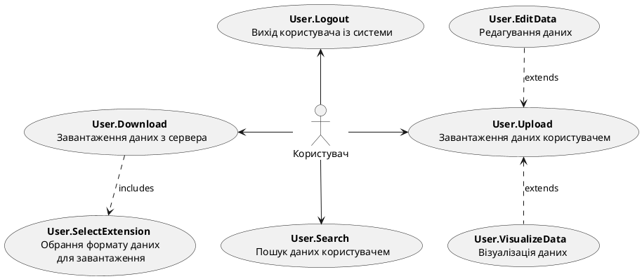

## Адміністратор

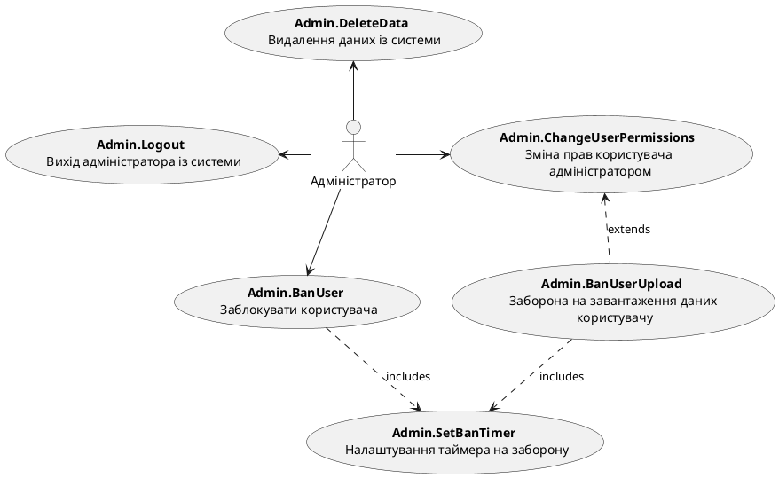

  
# Діаграми діяльності

| **ID:** |  SignIn |
|-|-|
| **НАЗВА:** | Ввійти в систему |
| **УЧАСНИКИ:** | Гість, Система |
| **ПЕРЕДУМОВИ:** | Гість має обліковий запис у системі |
| **РЕЗУЛЬТАТ:** | Виконано вхід в обліковий запис користувача |
| **ВИКЛЮЧНІ СИТУАЦІЇ:** | Введена електронна пошта некоректна - IncorrectEmail   Введений пароль некоректний - IncorrectPassword |
| **ОСНОВНИЙ СЦЕНАРІЙ:** | 1. Гість натискає кнопку "Увійти" на головній сторінці.   2. Гість вводить електронну пошту і пароль у форму входу.   3. Гість натискає кнопку "Підтвердити вхід".   4. Система перевіряє облікові дані.   5. Система повідомляє, що вхід успішно виконано. |

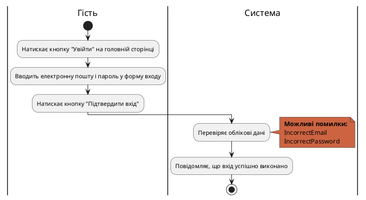

 

| **ID:** |  SignUp |
|-|-|
| **НАЗВА:** | Зареєструватися в системі |
| **УЧАСНИКИ:** | Гість, Система |
| **ПЕРЕДУМОВИ:** | Гість не має облікового запису в системі |
| **РЕЗУЛЬТАТ:** | Створено обліковий запис користувача |
| **ВИКЛЮЧНІ СИТУАЦІЇ:** | Пароль не відповідає умовам - InvalidPassword   Вказана електронна пошта не існує - InvalidEmail |
| **ОСНОВНИЙ СЦЕНАРІЙ:** | 1. Гість натискає кнопку "Зареєструватися" на головній сторінці.   2. Гість вводить електронну пошту і пароль у форму реєстрації.   3. Гість натискає кнопку "Підтвердити реєстрацію".   4. Система перевіряє облікові дані.   5. Система надсилає листа з підтвердженням реєстрації на електронну пошту користувача.   6. Користовач підтверджує реєстрацію.   7. Система створює обліковий запис користувача.   8. Система повідомляє, що обліковий запис успішно створено. |

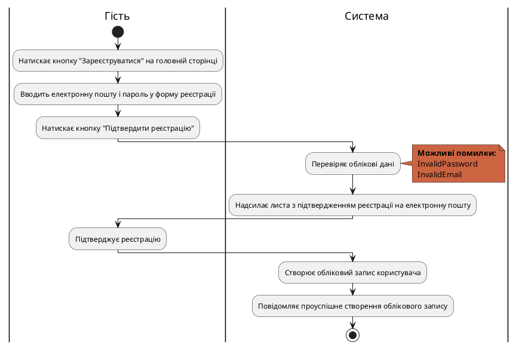

 

| **ID:** |  Logout |
|-|-|
| **НАЗВА:** | Вийти з системи |
| **УЧАСНИКИ:** | Користувач, Система |
| **ПЕРЕДУМОВИ:** | Користувач авторизований |
| **РЕЗУЛЬТАТ:** | Виконано вихід з облікового запису користувача |
| **ВИКЛЮЧНІ СИТУАЦІЇ:** | Відсутні |
| **ОСНОВНИЙ СЦЕНАРІЙ:** | 1. Користувач натискає кнопку "Вийти" на головній сторінці.   2. Користувач натискає кнопку "Підтвердити".   3. Система завершує сеанс користувача.   4. Сиситема повідомляє про успішний вихід з облікового запису. |

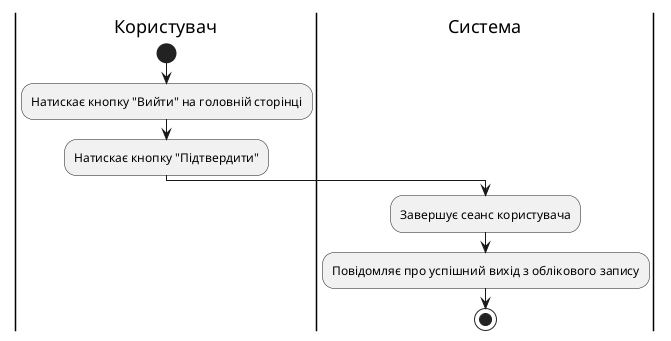

 

| **ID:** |  Search |
|-|-|
| **НАЗВА:** | Знайти дані за запитом |
| **УЧАСНИКИ:** | Користувач, Система |
| **ПЕРЕДУМОВИ:** | Наявність бази даних для пошуку |
| **РЕЗУЛЬТАТ:** | Шукані дані відображено |
| **ВИКЛЮЧНІ СИТУАЦІЇ:** | Дані не знайдено - DataNotFound |
| **ОСНОВНИЙ СЦЕНАРІЙ:** | 1. Користувач натискає кнопку "Пошук" на головній сторінці.   2. Користувач вводить пошуковий запит в пошуковий рядок.   3. Користувач натискає кнопку "Знайти".   4. Система здіснює пошук за запитом.   5. Система відображає шукані дані користувачу. |

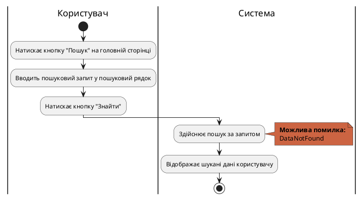

 

| **ID:** |  Download |
|-|-|
| **НАЗВА:** | Завантажити дані з системи |
| **УЧАСНИКИ:** | Користувач, Система |
| **ПЕРЕДУМОВИ:** | Користувач авторизований у системі |
| **РЕЗУЛЬТАТ:** | Дані завантажено на пристрій користувача |
| **ВИКЛЮЧНІ СИТУАЦІЇ:** | Помилка завантаження - DownloadError   Даних не існує - DataDoesNotExist |
| **ОСНОВНИЙ СЦЕНАРІЙ:** | 1. Користувач натискає кнопку "Завантажити" на сторінці з даними.   2. Користувач обирає формат файлу даних.   3. Користувач натискає кнопку "Підтвердити".   4. Система створює файл з даними.   5. Система завантажує дані на пристрій користувача.   6. Система повідомляє, що дані успішно завантажено. |

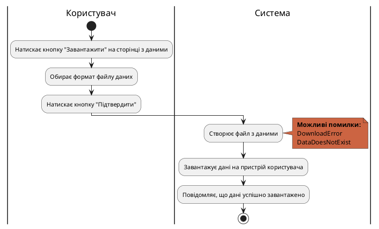

 

| **ID:** |  Upload |
|-|-|
| **НАЗВА:** | Завантажити дані в систему |
| **УЧАСНИКИ:** | Користувач, Система |
| **ПЕРЕДУМОВИ:** | Користувач авторизований у системі |
| **РЕЗУЛЬТАТ:** | Дані завантажено в систему |
| **ВИКЛЮЧНІ СИТУАЦІЇ:** | Файл не підтримується або пошкоджений - InvalidData |
| **ОСНОВНИЙ СЦЕНАРІЙ:** | 1. Користувач натискає кнопку "Додати дані" на головній сторінці.   2. Користувач обирає файл з даними на пристрої.   3. Користувач натискає кнопку "Додати".   4. Система обробляє дані.   5. Система завантажує дані в базу.   6. Система повідомляє, що дані успішно завантажено. |

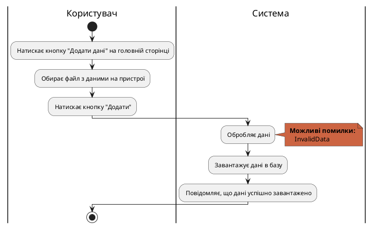

 

| **ID:** |  EditData |
|-|-|
| **НАЗВА:** | Змінити дані в системі |
| **УЧАСНИКИ:** | Користувач, Система |
| **ПЕРЕДУМОВИ:** | Користувач авторизований у системі   Користувач має право на редагування даних   Відкрито сторінку з даними |
| **РЕЗУЛЬТАТ:** | Дані змінено |
| **ВИКЛЮЧНІ СИТУАЦІЇ:** | Неправильний формат змінених даних - InvalidData |
| **ОСНОВНИЙ СЦЕНАРІЙ:** | 1. Користувач натискає кнопку "Змінити" на сторінці з даними.   2. Користувач вносить необхідні зміни.   3. Користувач натискає кнопку "Зберегти".   4. Система обробляє дані.   5. Система зберігає змінені дані.   6. Система повідомляє, що дані успішно змінено. |

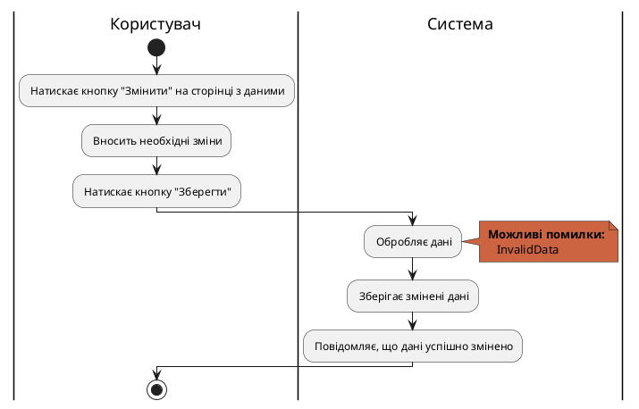

 

| **ID:** |  VisualizeData |
|-|-|
| **НАЗВА:** | Відобразити дані |
| **УЧАСНИКИ:** | Користувач, Система |
| **ПЕРЕДУМОВИ:** | Користувач авторизований у системі   Відкрито сторінку з даними |
| **РЕЗУЛЬТАТ:** | Дані відображено |
| **ВИКЛЮЧНІ СИТУАЦІЇ:** | Обраний формат візуалізації недоступний - InvalidVisualizationType   Дані неможливо візуалізувати - InvalidVisualizationData |
| **ОСНОВНИЙ СЦЕНАРІЙ:** | 1. Користувач натискає кнопку "Відобразити" на сторінці з даними.   2. Користувач обирає формат візуалізації даних.   3. Користувач натискає кнопку "Підтвердити".   4. Система створює візуалізацію у вибраному форматі.   5. Система відображає дані користувачу. |

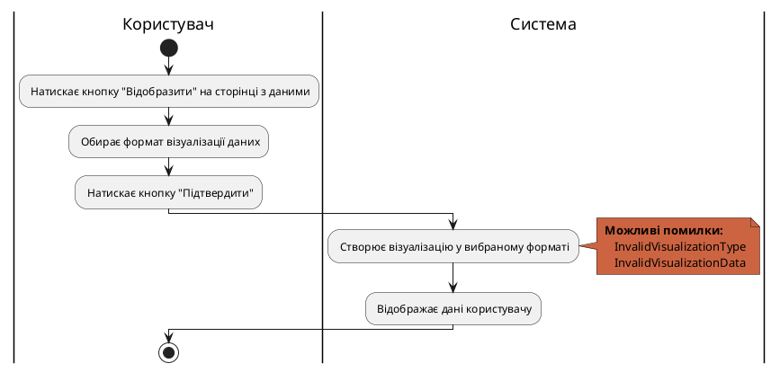
 

| **ID:** |  DeleteData |
|-|-|
| **НАЗВА:** | Видалити дані з системи |
| **УЧАСНИКИ:** | Адміністратор, Система |
| **ПЕРЕДУМОВИ:** | Адміністратор авторизований у системі |
| **РЕЗУЛЬТАТ:** | Дані видалено |
| **ВИКЛЮЧНІ СИТУАЦІЇ:** | Даних не існує - DataDoesNotExist |
| **ОСНОВНИЙ СЦЕНАРІЙ:** | 1. Адміністратор натискає кнопку "Видалити" на сторінці з даними.   2. Адміністратор натискає кнопку "Підтвердити".   3. Система видаляє дані з бази.   4. Система повідомляє, що дані успішно видалено. |

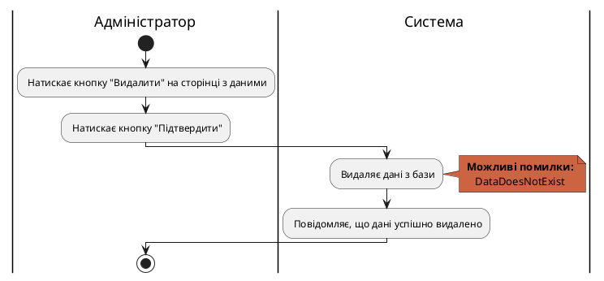
 

| **ID:** |  BanUser |
|-|-|
| **НАЗВА:** | 	Заблокувати користувача |
| **УЧАСНИКИ:** | Адміністратор, Система |
| **ПЕРЕДУМОВИ:** | Адміністратор авторизований |
| **РЕЗУЛЬТАТ:** | Обліковий запис користувача заблоковано |
| **ВИКЛЮЧНІ СИТУАЦІЇ:** | Користувача не існує - UserNotFound   Користувач вже заблокований - UserAlreadyBanned |
| **ОСНОВНИЙ СЦЕНАРІЙ:** | 1. Адміністратор натискає кнопку "Управління користувачами" на головній сторінці.   2. Адміністратор вводить ім'я користувача в пошуковий рядок.   3. Адміністратор натискає кнопку "Знайти".    4. Система здіснює пошук за запитом.   5. Система відображає шуканого користувача.   6. Адміністратор натискає кнопку "Заблокувати".   7. Адміністратор виставляє таймер блокування.   8. Адміністратор натискає кнопку "Підтвердити".   9. Система блокує користувача на вказаний період.   10. Система повідомляє, що користувача успішно заблоковано. |

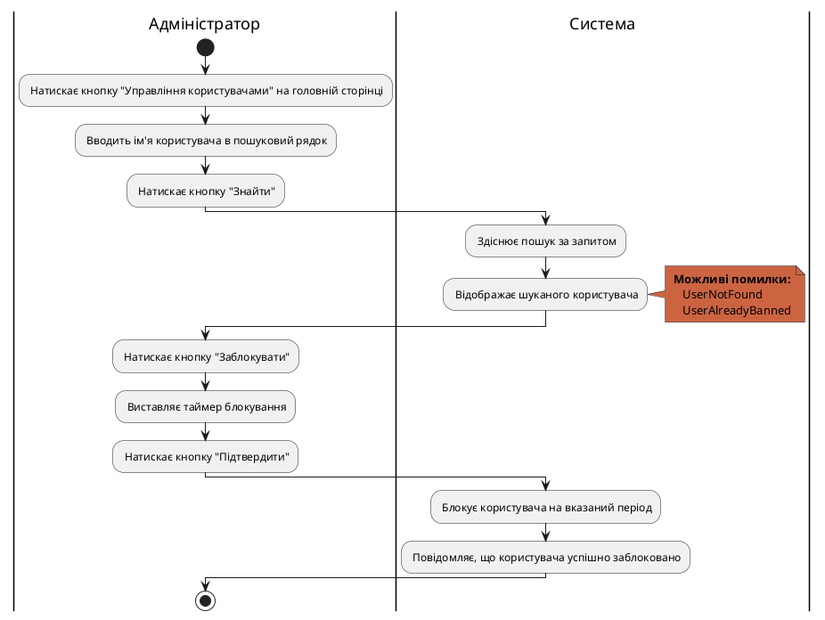