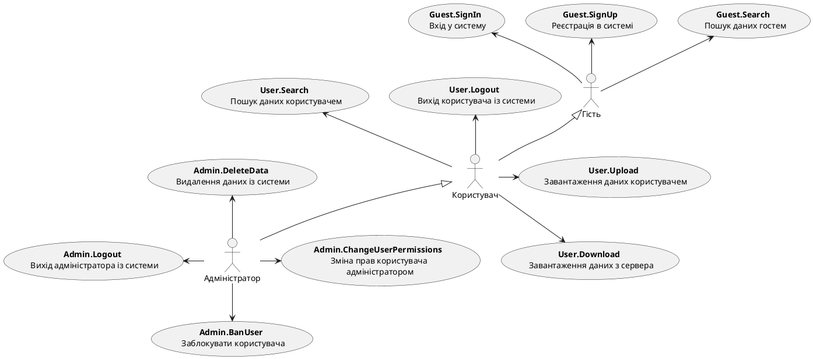
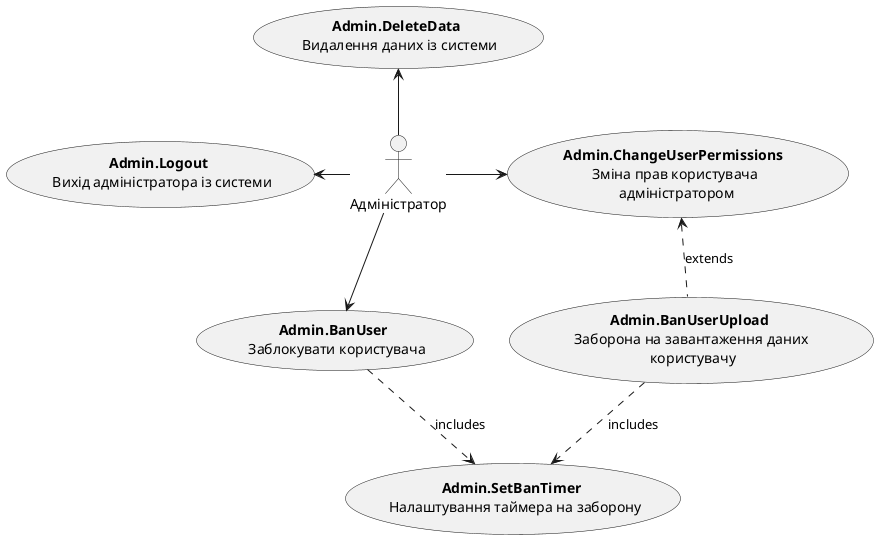

# Модель прецедентів

## Загальна схема

<center style="
    border-radius:4px;
    border: 1px solid #cfd7e6;
    box-shadow: 0 1px 3px 0 rgba(89,105,129,.05), 0 1px 1px 0 rgba(0,0,0,.025);
    padding: 1em;"
>



</center>

## Гість

<center style="
    border-radius:4px;
    border: 1px solid #cfd7e6;
    box-shadow: 0 1px 3px 0 rgba(89,105,129,.05), 0 1px 1px 0 rgba(0,0,0,.025);
    padding: 1em;"
>

@startuml

    actor "Гість" as Guest
    
    usecase "<b>Guest.Search<b> \n Пошук даних гостем" as GS
    usecase "<b>Guest.SignUp<b> \n Реєстрація в системі" as GSU
    usecase "<b>Guest.SignIn<b> \n Вхід у систему" as GSI
    
    Guest -u-> GS
    Guest -u-> GSU
    Guest -u-> GSI   

@enduml
```

</center>

## Користувач

<center style="
    border-radius:4px;
    border: 1px solid #cfd7e6;
    box-shadow: 0 1px 3px 0 rgba(89,105,129,.05), 0 1px 1px 0 rgba(0,0,0,.025);
    padding: 1em;"
>

@startuml

    actor "Користувач" as User
    
    usecase "<b>User.Logout<b> \n Вихід користувача із системи" as ULO
    usecase "<b>User.Search<b> \n Пошук даних користувачем" as US
    usecase "<b>User.Download<b> \n Завантаження даних з сервера" as UD
    usecase "<b>User.Upload<b> \n Завантаження даних користувачем" as UUP
    usecase "<b>User.EditData<b> \n Редагування даних" as UED
    usecase "<b>User.VisualizeData<b> \n Візуалізація даних" as UVD
    usecase "<b>User.SelectExtension<b> \n Обрання формату даних \n для завантаження" as USE

    User -u-> ULO
    User -d-> US
    User -r-> UUP
    User -l-> UD

    UED .d.> UUP:extends
    UVD .u.> UUP:extends
    UD .d.> USE:includes
    
@enduml

```

</center>

## Адміністратор

<center style="
    border-radius:4px;
    border: 1px solid #cfd7e6;
    box-shadow: 0 1px 3px 0 rgba(89,105,129,.05), 0 1px 1px 0 rgba(0,0,0,.025);
    padding: 1em;"
>



</center>
